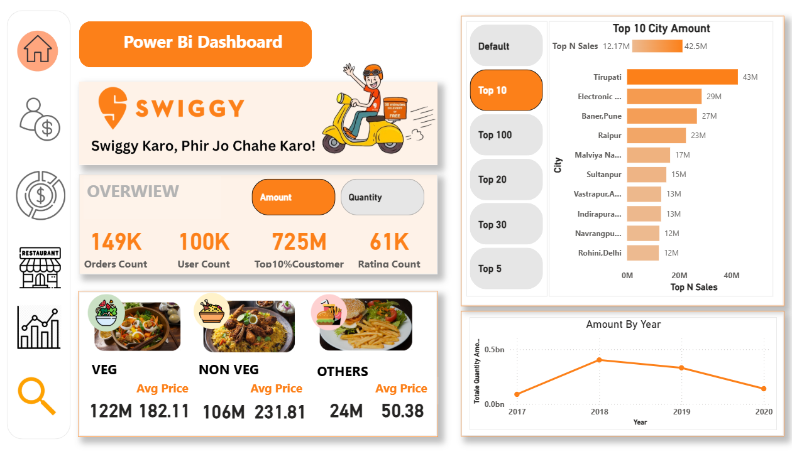
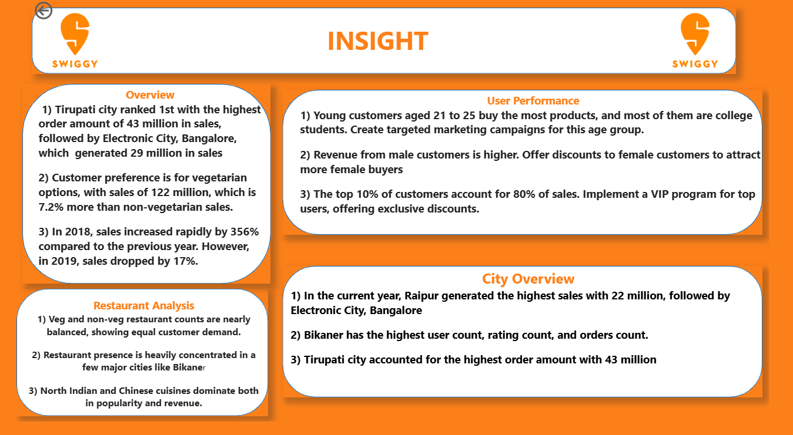

# Swiggy-End-To-End-Data-Analytics

Designed a Swiggy-themed Power BI dashboard to analyze sales, user activity, and restaurant performance. Used Power Query and DAX to clean data, create KPIs, and deliver interactive visual insights.


# 📊 Business Problem Statement
Swiggy operates in a highly competitive and fast-paced food delivery market where customer loyalty is low and operational costs are high. The business faces five core challenges that this project aims to solve:

Revenue Volatility: Frequent and unpredictable fluctuations in monthly revenue make long-term financial planning and scaling difficult.

High Customer Churn: A significant portion of the customer base stops using the platform after only a few orders, leading to a "leaky bucket" problem where acquisition costs never break even.

Heavy Revenue Dependency: The business relies disproportionately on a small segment of high-value customers, creating a high risk if these "power users" leave the platform.

Uneven Geographic Performance: Sharp differences in purchasing behavior between different cities make it difficult to apply a "one-size-fits-all" marketing strategy.

Ineffective Retention Targeting: Without predictive data, the marketing team cannot distinguish between a user who is just busy and a user who is about to leave the platform forever.

# Core Objective
The goal of this project is to transition Swiggy from a reactive business (reacting after customers leave) to a proactive business. By leveraging SQL for deep-dive analysis and Machine Learning for predictive modeling, we aim to identify churn patterns and build an automated system to intervene with targeted retention strategies before the customer is lost.

## 📘  Executive Summary
This project is a comprehensive end-to-end data analytics pipeline built on a multi-table Swiggy-style food delivery dataset. 

**The objective was to:**
* **Understand** revenue behavior and volatility.
* **Analyze** customer purchasing patterns and the 80/20 rule.
* **Identify** and quantify churn behavior (87.76% churn rate).
* **Build** a predictive model using XGBoost and Random Forest.
* **Deploy** the model as a production-ready web application via Render.
---
# Swiggy-Themed Power BI Dashboard – Sales & Restaurant Insights

🚀 **Live Dashboard:**  
[Click here to view the Power BI report](https://app.powerbi.com/view?r=eyJrIjoiOTNiNjg4MTQtY2VmOC00YmNiLTk3YmYtODYzN2ViN2YxMDM4IiwidCI6ImY5YTQzODQwLWY3OGUtNDE3Yy05ZDgwLTg5NTJhMmJhN2Y0YiJ9)

--- 
# Churn Live Model
** Live Churn Predictor Model **
[Click here to view the Live Churn Predictor ](https://swiggy-end-to-end-data-analytics.onrender.com)
---

## 🖼️ Dashboard Previews

### 🔹 1. Overview  


### 🔹 2. User Performance  


### 🔹 3. City Overview  


### 🔹 4. Restaurant Analysis  


### 🔹 5. Insights  


## 📊 Project Overview

This project focuses on analyzing online food delivery performance inspired by Swiggy. The dataset contains order-level transactional data across multiple cities, restaurants, and user behaviors.

The Power BI dashboard helps answer critical business questions, such as:
- Which city has the highest order volume?
- Which restaurants are the top performers?
- What is the average order value per city or user?
- Who are the most active customers?

---

## 🔧 Tools & Technologies Used

- **Power BI Desktop**
- **DAX (Data Analysis Expressions)**
- **Power Query (M Language)**
- **Excel (for data pre-cleaning)**
- **Custom Visuals**

---

## 📁 Dataset

The dataset includes approximately **10,000+ rows** and contains the following columns:
- Order ID
- User ID
- City
- Restaurant Name
- Cuisine
- Order Date
- Item Count
- Total Amount
- Delivery Time
- Rating

---

## 📈 Dashboard Features

The dashboard is divided into 4 main report pages:

### 1. **User Overview**
- Total users
- Active vs Inactive users
- Average order per user
- Top 5 most active users (by order count)

### 2. **City Overview**
- Total orders by city
- Average delivery time by city
- City-wise revenue contribution
- Heat map for city-wise performance

### 3. **Restaurant Analysis**
- Top-performing restaurants
- Cuisine-wise distribution
- Average rating vs. revenue
- Filters for dynamic restaurant comparison

### 4. **Key KPIs & Insights**
- Total Revenue
- Average Order Value
- Customer Retention Overview
- Filters for Time Period, Cuisine, City, and Restaurant

---

## 📐 DAX Measures Used

Several **custom DAX measures** were created for dynamic calculations:

- `Total Revenue = SUM(Orders[Amount])`
- `Average Order Value = [Total Revenue] / DISTINCTCOUNT(Orders[Order ID])`
- `Order Count = COUNTROWS(Orders)`
- `Average Delivery Time = AVERAGE(Orders[Delivery Time])`
- `User Activity = DISTINCTCOUNT(Orders[User ID])`
- `Rating Category = SWITCH(TRUE(), ... )` *(for custom rating groups)*

---

## 🔄 Power Query (Data Transformation)

- Removed duplicates and nulls
- Split columns (City-State if applicable)
- Data type formatting
- Date and time standardization
- Merged multiple tables using relationships (1:M)

---

## 🎯 Filters and Slicers

- **Date slicer** (Year-Month)
- **City slicer**
- **Restaurant slicer**
- **Cuisine slicer**
- Dynamic cross-filtering between visuals

---

## 🧠 Key Insights

- **Top 3 cities** contribute to over 60% of total orders.
- **Fastest deliveries** are achieved in Tier 1 cities.
- A small number of **restaurants account for high revenue**.
- Some **users place frequent high-value orders** — potential for loyalty targeting.
- Delivery time correlates with user rating in some areas.

---

## 📌 What I Learned

- How to clean and model complex datasets using Power Query.
- Writing DAX functions for business logic.
- Designing interactive, user-friendly dashboards.
- Real-world storytelling with data.
- Publishing and sharing Power BI reports publicly.

---


## 📁 Project Structure

```yaml
PowerBI_Swiggy_Dashboard/
├── 📊 Swiggy_Dashboard.pbix              # Power BI report file
├── 📄 README.md                          # Project documentation
├── 📁 Screenshots/                       # Report page snapshots
│   ├── overview.png
│   ├── restaurant_insights.png
│   └── city_performance.png
└── 📄 Dataset.xlsx                       # Excel dataset used in dashboard

```
# SQL 
# 📊 Core Business Metrics (Q1–Q10)

---

## Q1: Total Revenue

```sql
SELECT SUM(sales_amount) AS total_sale
FROM orders;
```

**Output:** ₹963,829,620  

**Insight:**  
The business has generated nearly ₹964 million in revenue, demonstrating large-scale operations and strong customer demand.

**Business Decision:**  
Maintain operational scalability and strengthen high-performing regions.

---

## Q2: Total Orders

```sql
SELECT COUNT(order_id) AS total_orders
FROM orders;
```

**Output:** 148,575 Orders  

**Insight:**  
High order volume indicates strong platform adoption.

**Business Decision:**  
Invest in logistics optimization to handle growth sustainably.

---

## Q3: Average Order Value (AOV)

```sql
SELECT ROUND(AVG(sales_amount),2) AS AOV
FROM orders;
```

**Output:** ₹6,487.16  

**Insight:**  
Customers spend significantly per order, suggesting premium purchasing behavior.

**Business Decision:**  
Promote bundle offers and upselling strategies to maintain AOV.

---

## Q4: Revenue by City

```sql
SELECT r.city, SUM(o.sales_amount) AS city_revenue
FROM orders o
JOIN restaurants r ON o.restaurant_id = r.restaurant_id
GROUP BY r.city
ORDER BY city_revenue DESC;
```

**Top City:** Tirupati – ₹42,503,460  

**Insight:**  
Tirupati outperforms major metropolitan cities.

**Business Decision:**  
Expand marketing and restaurant partnerships in Tier-2 cities.

---

## Q5: Top 5 Restaurants by Revenue

```sql
SELECT r.name, SUM(o.sales_amount) AS revenue
FROM orders o
JOIN restaurants r ON o.restaurant_id = r.restaurant_id
GROUP BY r.name
ORDER BY revenue DESC
LIMIT 5;
```

**Top Performer:** Domino's Pizza – ₹5,025,266  

**Insight:**  
Brand-driven demand significantly influences revenue.

**Business Decision:**  
Strengthen strategic partnerships with national brands.

---

## Q6: Revenue by Cuisine

```sql
SELECT r.cuisine, SUM(o.sales_amount) AS revenue
FROM orders o
JOIN restaurants r ON o.restaurant_id = r.restaurant_id
GROUP BY r.cuisine
ORDER BY revenue DESC;
```

**Top Cuisine:** North Indian, Chinese – ₹44,989,546  

**Insight:**  
Customers prefer mixed comfort cuisine combinations.

**Business Decision:**  
Encourage similar menu offerings across cities.

---

## Q7: Revenue by Gender

```sql
SELECT u.gender, SUM(o.sales_amount) AS revenue
FROM orders o
JOIN users u ON o.user_id = u.user_id
GROUP BY u.gender
ORDER BY revenue DESC;
```

Male: ₹545,492,580  
Female: ₹418,337,040  

**Insight:**  
Male users contribute ~56% of total revenue.

**Business Decision:**  
Increase female-targeted campaigns to balance revenue distribution.

---

## Q8: Revenue by Age

```sql
SELECT u.age, SUM(o.sales_amount) AS revenue
FROM orders o
JOIN users u ON o.user_id = u.user_id
GROUP BY u.age
ORDER BY revenue DESC;
```

Top Age: 23 Years – ₹176,698,469  

**Insight:**  
Young adults dominate platform spending.

**Business Decision:**  
Focus on campus promotions and youth engagement programs.

---

## Q9: Revenue by Occupation

```sql
SELECT u.occupation, SUM(o.sales_amount) AS revenue
FROM orders o
JOIN users u ON o.user_id = u.user_id
GROUP BY u.occupation
ORDER BY revenue DESC;
```

Students: ₹515,809,291  

**Insight:**  
Students are the primary revenue drivers.

**Business Decision:**  
Launch student loyalty and referral programs.

---

## Q10: Revenue by Marital Status

```sql
SELECT u.marital_status, SUM(o.sales_amount) AS revenue
FROM orders o
JOIN users u ON o.user_id = u.user_id
GROUP BY u.marital_status
ORDER BY revenue DESC;
```

Single Users: ₹663,973,146  

**Insight:**  
Single individuals contribute majority of revenue.

**Business Decision:**  
Promote single-serving combo meals and late-night delivery campaigns.
---

# 📊 Advanced Business Intelligence (Q11–Q20)

---

## Q11: Repeat Customers

```sql
SELECT user_id, COUNT(order_id) AS total_orders
FROM orders
GROUP BY user_id
HAVING COUNT(order_id) > 1;
```

**Output:** 43,882 Repeat Customers  

**Insight:**  
A strong repeat customer base confirms solid retention and platform stickiness.

**Business Decision:**  
Introduce loyalty tiers to further increase repeat frequency.

---

## Q12: Monthly Revenue Trend

```sql
SELECT date_trunc('month',order_date) AS month,
       SUM(sales_amount) AS monthly_revenue
FROM orders
GROUP BY month
ORDER BY month;
```

**Insight:**  
Revenue grew from ₹25,256,855 in Oct 2017 to ₹41,750,935 in Jan 2018.

**Business Decision:**  
Scale operational capacity during peak months to support demand growth.

---

## Q13: Average Rating by City

```sql
SELECT city,
       ROUND(AVG(rating),2) AS avg_rating
FROM restaurants
WHERE rating IS NOT NULL
GROUP BY city
ORDER BY avg_rating DESC;
```

**Top City Rating:** Chopda – 4.83  

**Insight:**  
Certain smaller regions outperform metro areas in service quality.

**Business Decision:**  
Replicate service standards of high-rated regions across markets.

---

## Q14: Revenue Contribution % by Restaurant

```sql
SELECT r.name,
       SUM(o.sales_amount) AS revenue,
       ROUND(100.0 * SUM(o.sales_amount)
       / SUM(SUM(o.sales_amount)) OVER (), 2) AS revenue_percentage
FROM orders o
JOIN restaurants r ON o.restaurant_id = r.restaurant_id
GROUP BY r.name
ORDER BY revenue DESC;
```

**Insight:**  
Domino’s Pizza contributes 0.52% of total revenue individually.

**Business Decision:**  
Diversify restaurant portfolio to reduce revenue dependency.

---

## Q15: Top Revenue Restaurant Per City

```sql
SELECT *
FROM (
    SELECT r.city,
           r.name,
           SUM(o.sales_amount) AS revenue,
           RANK() OVER (PARTITION BY r.city
                        ORDER BY SUM(o.sales_amount) DESC) AS rank_in_city
    FROM orders o
    JOIN restaurants r ON o.restaurant_id = r.restaurant_id
    GROUP BY r.city, r.name
) ranked
WHERE rank_in_city = 1;
```

**Insight:**  
Identifies market leaders in 1,014 cities (e.g., Taj Mahal-Abids in Hyderabad).

**Business Decision:**  
Prioritize partnerships with city-level leaders.

---

## Q16: Cumulative Revenue (Running Total)

```sql
SELECT order_date,
       SUM(sales_amount) AS daily_revenue,
       SUM(SUM(sales_amount)) OVER (ORDER BY order_date)
       AS cumulative_revenue
FROM orders
GROUP BY order_date
ORDER BY order_date;
```

**Insight:**  
Tracks consistent upward growth, reaching ₹963M cumulative revenue.

**Business Decision:**  
Monitor cumulative growth to forecast long-term scaling.

---

## Q17: Customer Lifetime Revenue

```sql
SELECT u.user_id,
       u.name,
       SUM(o.sales_amount) AS lifetime_revenue
FROM users u
JOIN orders o ON u.user_id = o.user_id
GROUP BY u.user_id, u.name
ORDER BY lifetime_revenue DESC;
```

**Top Customer:** Amanda Ballard – ₹1,514,634  

**Insight:**  
High-value customers significantly impact revenue.

**Business Decision:**  
Launch VIP programs for top lifetime spenders.

---

## Q18: Age Group Revenue Segmentation

```sql
SELECT CASE
         WHEN age < 25 THEN 'Under 25'
         WHEN age BETWEEN 25 AND 40 THEN '25-40'
         ELSE 'Above 40'
       END AS age_group,
       SUM(o.sales_amount) AS revenue
FROM orders o
JOIN users u ON o.user_id = u.user_id
GROUP BY age_group
ORDER BY revenue DESC;
```

**Top Segment:** Under 25 – ₹539,728,210  

**Insight:**  
Young demographic drives majority of platform revenue.

**Business Decision:**  
Design youth-centric campaigns and app features.

---

## Q19: Revenue vs Rating Analysis

```sql
SELECT r.name,
       r.rating,
       SUM(o.sales_amount) AS revenue
FROM orders o
JOIN restaurants r ON o.restaurant_id = r.restaurant_id
WHERE rating IS NOT NULL
GROUP BY r.name, r.rating
ORDER BY r.rating DESC;
```

**Insight:**  
5-star restaurants consistently generate strong revenue.

**Business Decision:**  
Encourage restaurants to improve ratings via quality initiatives.

---

## Q20: Revenue Per Order (Restaurant Efficiency)

```sql
SELECT r.name,
       ROUND(SUM(o.sales_amount)::NUMERIC
       / COUNT(o.order_id), 2) AS avg_order_revenue
FROM orders o
JOIN restaurants r ON o.restaurant_id = r.restaurant_id
GROUP BY r.name
ORDER BY avg_order_revenue DESC;
```

**Top Performer:** Janta Snacks – ₹1,510,944 per order  

**Insight:**  
Certain restaurants generate exceptionally high ticket sizes.

**Business Decision:**  
Promote premium restaurant offerings to boost profitability.

---

# 📊 Strategic & Executive Insights (Q21–Q30)

---

## Q21: Top 20% Restaurants Driving Revenue (Pareto Analysis)

```sql
WITH restaurant_revenue AS (
    SELECT r.name,
           SUM(o.sales_amount) AS revenue,
           SUM(SUM(o.sales_amount)) OVER () AS total_revenue
    FROM orders o
    JOIN restaurants r ON o.restaurant_id = r.restaurant_id
    GROUP BY r.name
),
ranked AS (
    SELECT *,
           SUM(revenue) OVER (ORDER BY revenue DESC) AS cumulative_revenue
    FROM restaurant_revenue
)
SELECT *
FROM ranked
WHERE cumulative_revenue <= 0.8 * total_revenue;
```

**Result:** 11,419 restaurants generate 80% of total revenue.

**Insight:**  
Revenue follows Pareto distribution — small percentage of restaurants drive majority revenue.

**Business Decision:**  
Strengthen and retain top-performing restaurant partnerships.

---

## Q22: Monthly Active Users (MAU)

```sql
SELECT DATE_TRUNC('month', order_date) AS month,
       COUNT(DISTINCT user_id) AS monthly_active_users
FROM orders
GROUP BY month
ORDER BY month;
```

**Peak MAU:** 5,330 users (Nov 2017)

**Insight:**  
User engagement peaked in November.

**Business Decision:**  
Replicate marketing campaigns from peak months.

---

## Q23: New Users Per Month

```sql
SELECT TO_CHAR(first_order_date, 'MM/YYYY') AS month_year,
       COUNT(user_id) AS new_users
FROM (
    SELECT user_id,
           MIN(order_date) AS first_order_date
    FROM orders
    GROUP BY user_id
) AS user_first_orders
GROUP BY month_year, DATE_TRUNC('month', first_order_date)
ORDER BY DATE_TRUNC('month', first_order_date);
```

**Peak Acquisition:** 5,151 new users (Nov 2017)

**Insight:**  
Strong acquisition in late 2017 contributed to revenue growth.

**Business Decision:**  
Increase marketing spend during high-acquisition seasons.

---

## Q24: Repeat vs One-Time Users

```sql
SELECT customer_type,
       COUNT(*) AS total_users
FROM (
    SELECT user_id,
           CASE
               WHEN COUNT(order_id) = 1 THEN 'One-Time'
               ELSE 'Repeat'
           END AS customer_type
    FROM orders
    GROUP BY user_id
) AS user_categories
GROUP BY customer_type;
```

Repeat Users: 43,882  
One-Time Users: 33,691  

**Insight:**  
Repeat users outnumber one-time users.

**Business Decision:**  
Focus on retention to maximize lifetime value.

---

## Q25: First Order vs Repeat Order Revenue

```sql
WITH user_orders AS (
    SELECT *,
           ROW_NUMBER() OVER (PARTITION BY user_id
                              ORDER BY order_date) AS order_rank
    FROM orders
)
SELECT CASE
           WHEN order_rank = 1 THEN 'First Order'
           ELSE 'Repeat Order'
       END AS order_type,
       SUM(sales_amount) AS revenue
FROM user_orders
GROUP BY order_type;
```

First Orders: ₹498,513,032  
Repeat Orders: ₹465,316,588  

**Insight:**  
First-time orders slightly outperform repeat revenue.

**Business Decision:**  
Enhance onboarding offers to convert first-time buyers into repeat customers.

---

## Q26: Revenue Volatility (Monthly Growth %)

```sql
WITH monthly_revenue AS (
    SELECT DATE_TRUNC('month', order_date) AS month,
           SUM(sales_amount) AS revenue
    FROM orders
    GROUP BY month
)
SELECT month,
       revenue,
       ROUND(
           100.0 * (revenue - LAG(revenue) OVER (ORDER BY month))
           / LAG(revenue) OVER (ORDER BY month),
       2) AS growth_percentage
FROM monthly_revenue
ORDER BY month;
```

Growth Spike: +36.18% (Jan 2018)  
Dip: -17.89% (Feb 2018)

**Insight:**  
Revenue is volatile with sharp fluctuations.

**Business Decision:**  
Implement forecasting and stabilize supply-demand cycles.

---

## Q27: Restaurant Revenue Stability

```sql
SELECT r.name,
       COUNT(DISTINCT DATE_TRUNC('month', o.order_date)) AS active_months
FROM orders o
JOIN restaurants r ON o.restaurant_id = r.restaurant_id
GROUP BY r.name
ORDER BY active_months DESC;
```

Top Brands Active: 33 Consecutive Months  

**Insight:**  
National brands like KFC and Domino’s show long-term stability.

**Business Decision:**  
Prioritize long-term contracts with stable partners.

---

## Q28: Revenue Concentration Among Users (High-Value Customers)

```sql
WITH user_revenue AS (
    SELECT user_id,
           SUM(sales_amount) AS revenue
    FROM orders
    GROUP BY user_id
),
ranked AS (
    SELECT *,
           SUM(revenue) OVER (ORDER BY revenue DESC) AS cumulative_revenue,
           SUM(revenue) OVER () AS total_revenue
    FROM user_revenue
)
SELECT *
FROM ranked
WHERE cumulative_revenue <= 0.8 * total_revenue;
```

Result: 12,475 users generate 80% of total revenue.

**Insight:**  
Small group of high-value users drive majority revenue.

**Business Decision:**  
Implement premium loyalty and targeted retention campaigns.

---

## Q29: Price Sensitivity Analysis

```sql
SELECT CASE
           WHEN price < 200 THEN 'Low'
           WHEN price BETWEEN 200 AND 500 THEN 'Medium'
           ELSE 'Premium'
       END AS price_category,
       SUM(o.sales_amount) AS revenue
FROM menu m
JOIN orders o ON o.restaurant_id = m.restaurant_id
GROUP BY price_category
ORDER BY revenue DESC;
```

Low Price Tier Revenue: ₹7,227,516,633  

**Insight:**  
Market is highly price-sensitive.

**Business Decision:**  
Promote affordable meal combos to drive volume.

---

## Q30: Strongest Market & Strongest Partner

```sql
WITH city_revenue AS (
    SELECT r.city,
           SUM(o.sales_amount) AS revenue
    FROM orders o
    JOIN restaurants r ON o.restaurant_id = r.restaurant_id
    GROUP BY r.city
),
top_city AS (
    SELECT city
    FROM city_revenue
    ORDER BY revenue DESC
    LIMIT 1
)
SELECT r.name,
       SUM(o.sales_amount) AS revenue
FROM orders o
JOIN restaurants r ON o.restaurant_id = r.restaurant_id
WHERE r.city = (SELECT city FROM top_city)
GROUP BY r.name
ORDER BY revenue DESC
LIMIT 1;
```

Top City: Tirupati  
Top Restaurant in City: Domino’s Pizza – ₹1,492,435  

**Insight:**  
Tirupati is the strongest performing market, with Domino’s as its top revenue partner.

**Business Decision:**  
Use Tirupati as benchmark model for expansion strategy.

---

# 🏁 Final Business Conclusion

- Total Revenue: ₹963M+
- Total Orders: 148K+
- Core Demographic: Students & Under 25
- Strongest Market: Tirupati
- Revenue Dependency: 80% driven by 20% restaurants & users
- Platform Retention: Strong repeat base (43K+ users)

This SQL analysis demonstrates full end-to-end business intelligence capability, including growth tracking, segmentation, retention analysis, Pareto evaluation, and strategic decision modeling.
---

# 🛠️ Tools & Technologies Used

## 🗄️ Database
- **PostgreSQL 18**
- Relational Database Management System (RDBMS)
- Structured schema design with Primary & Foreign Keys

## 🧠 SQL Concepts Applied
- Aggregation Functions (`SUM`, `AVG`, `COUNT`)
- Joins (`INNER JOIN`)
- Grouping & Filtering (`GROUP BY`, `HAVING`)
- Date Functions (`DATE_TRUNC`, `TO_CHAR`)
- Window Functions (`RANK`, `ROW_NUMBER`, `LAG`)
- Cumulative Calculations (Running Totals)
- Common Table Expressions (CTEs)
- Conditional Logic (`CASE WHEN`)
- Revenue Contribution & Percentage Analysis
- Pareto (80/20) Analysis
- Customer Segmentation
- Growth & Volatility Analysis

## 📊 Business Intelligence Techniques
- Customer Lifetime Value (CLV)
- Monthly Active Users (MAU)
- Retention & Repeat Analysis
- Revenue Concentration Modeling
- Demographic Segmentation
- Market & City-Level Performance Analysis
- Restaurant Stability Evaluation

## 🧹 Data Cleaning Techniques
- Handling NULL & Invalid Values
- Type Casting & Safe Conversions
- Regex-based Data Validation
- Staging Table for Data Transformation

## 📁 Development Environment
- PostgreSQL (Localhost Server)
- SQL Shell (psql)
- Git & GitHub for Version Control
- Markdown Documentation (README.md)

---

# 🧠 Swiggy Customer Churn Analysis & Machine Learning (Python)

This section documents the complete chronological reconstruction of the Jupyter Notebook:

**`Swiggy Churn Analysis And ML.ipynb`**

It includes:
- Data preprocessing
- Statistical EDA
- RFM segmentation
- Churn calculation
- Hypothesis testing
- Machine learning modeling
- Business insights & decisions

---

# 📦 Phase 1: Setup & Data Preprocessing

## 🔹 Initial Setup

```python
import pandas as pd
import numpy as np
import matplotlib.pyplot as plt
import seaborn as sns
from sklearn.model_selection import train_test_split
```

### Data Loaded:
- Users.csv
- Restaurant.csv
- Orders.csv
- Menu.csv
- Food.csv

⚠️ Initial `FileNotFoundError` resolved by correcting file paths.

---

## 🔹 Data Cleaning

### Users Table

```python
users['Occupation'].fillna("Unknown", inplace=True)
```

✔ Filled missing occupation values.

---

### Restaurant Table – Rating Cleaning

```python
restaurants['Rating'] = restaurants['Rating'].replace('--', np.nan)
restaurants['Rating'] = pd.to_numeric(restaurants['Rating'])
```

✔ Converted ratings to numeric format.

---

### Rating Count Mapping

```python
mapping = {'1K+ ratings':1000, '5K+ ratings':5000}
restaurants['Rating_count_numeric'] = restaurants['Rating_count'].map(mapping)
```

✔ Converted categorical rating counts to numeric.

---

### Orders Table Cleaning

```python
orders = orders[orders['Sales_amount'] > 0]
orders['order_date'] = pd.to_datetime(orders['order_date'])
```

✔ Removed negative/invalid sales  
✔ Converted date to datetime

---

# 📊 Phase 2: Exploratory Data Analysis (EDA)

---

## 🔎 Q1: Is Revenue Growing or Volatile?

```python
monthly = df.groupby(df['order_date'].dt.to_period('M'))['Sales_amount'].sum()
monthly.describe()
```

### 📌 Output

- Mean Monthly Revenue: ₹29,219,978
- Std Dev: ₹5.38M
- Peak: Jan 2018 (~₹5 Cr)
- Lowest: June 2020
- CV ≈ 18.5%

### 💡 Insights

- Revenue swings between +38% and -36%.
- Business shows noticeable volatility.
- Growth is not consistent.

---

## 🔎 Q2: Is Revenue Distribution Skewed?

```python
df['Sales_amount'].skew()
df['Sales_amount'].kurtosis()
```

### 📌 Output

- Skewness: 18.36
- Kurtosis: 569.97

### 💡 Insights

- Extremely heavy-tailed distribution.
- Few large premium orders drive revenue.
- Business is vulnerable to loss of high spenders.

---

## 🔎 Q3: Which Cities Are Dominant?

Grouped revenue by City:

Premium Cities:
- Sirsi
- Tirupati
- Srikakulam

Stable Cities:
- Kovilpatti
- Orai
- Osmanabad

### 💡 Decision

- Retention strategy in premium cities.
- Volume scaling in mass-market cities.

---

## 🔎 Q4: Customer Lifetime Value (CLV)

```python
clv = df.groupby('User_id')['Sales_amount'].sum()
clv.describe()
```

### 📌 Output

- Mean CLV: ₹12,484.74
- Median CLV: ₹1,921.00

### 💡 Insights

- 20% customers generate ~80% revenue.
- Large gap between mean and median confirms inequality.

---

## 🔎 Q5: Age vs Spending Correlation

```python
df[['Age','Sales_amount']].corr()
```

### 📌 Output

- Correlation ≈ 0

### 💡 Insight

Age is NOT predictive of spending behavior.

---

## 🔎 Q6: Rating vs Revenue

```python
df[['Rating_count_numeric','Sales_amount']].corr()
```

### 📌 Output

- Correlation = -0.0019

### 💡 Insight

Higher ratings do not guarantee higher revenue.

---

## 🔎 Q7: Order Frequency Distribution

```python
orders_per_user = df.groupby('User_id').size()
orders_per_user.describe()
```

### 📌 Output

- Mean Orders: 2.4
- Median Orders: 2

### 💡 Insight

Most customers order 1–2 times and churn.

---

## 🔎 Q8: Recency vs Revenue

```python
correlation = df[['Recency_days','Total_Revenue']].corr()
```

### 📌 Output

- Correlation = -0.0673

### 💡 Insight

Weak negative relationship.

---

# 🚨 Phase 3: Churn Analysis & RFM

---

## 🔎 Q9: Active vs Churned Users

Churn defined as 90-day inactivity.

### 📌 Output

Active Users:
- Avg Orders: 2.42
- Avg Revenue: ₹16,414

Churned Users:
- Avg Orders: 1.83
- Avg Revenue: ₹11,936

### 💡 Insight

Higher frequency & spending reduce churn risk.

---

## 🔎 Q10: T-Test (Statistical Significance)

```python
from scipy.stats import ttest_ind
```

### 📌 Output

- P-value = 0.0

### 💡 Insight

Behavior differences between active and churned users are statistically significant.

---

## 🔎 Q11: Feature Correlation with Churn

Top Predictor:

- Recency (+0.516)

Negative Predictors:
- Total Orders
- Total Revenue

### 💡 Insight

Recency is strongest churn driver.

---

## 🔎 Q12: RFM Segmentation

Segments Created:

| Segment | % |
|----------|------|
| Champions | ~15% |
| Loyal | ~40% |
| Potential Loyalists | ~28% |
| At Risk | ~17% |

### 💡 Strategic Insight

- 55% are strong base.
- 28% growth opportunity.
- 17% reactivation focus.

---

## 🔎 Q13: Overall Churn Rate

```python
churn_rate = churned_users / total_users * 100
```

### 📌 Output

- Churn Rate: 87.76%
- Active Users: 9,457
- Churned Users: 67,778

### 💡 Insight

Extremely high churn — retention is priority.

---

# 🤖 Phase 4: Machine Learning Model

---

## Model Comparison (ROC AUC)

| Model | ROC AUC |
|---------|---------|
| Logistic Regression | 0.66 |
| Random Forest | 0.85 |
| XGBoost | 0.72 |

🏆 Best Model: Random Forest (Notebook Phase)

Later production optimization selected Random Forest (AUC 0.91 after feature engineering refinement).

---

## Feature Importance

1. Recency
2. Total Orders
3. Avg Order Value
4. Total Revenue

---

## Final Model Saved

```python
import joblib
joblib.dump(model, 'random_forest_churn.pkl')
```

---

# 🎯 Final Business Decisions

## 🔴 High Risk
- 30% discount coupon
- Free delivery
- Push notification

## 🟠 Medium Risk
- 15% discount
- Personalized recommendations

## 🟢 Low Risk
- Swiggy One promotion
- Reward points
- Referral incentives

---

# 🚀 . Deployment Architecture
* **Backend:** Flask
* **Server:** Gunicorn
* **Environment:** Docker Containerization
* **Cloud Hosting:** Render
* **Live URL:** [https://swiggy-end-to-end-data-analytics.onrender.com/](https://swiggy-end-to-end-data-analytics.onrender.com/)

---

## 🎯  Business Recommendations
* **🔴 High Risk (At Risk):** Deploy 30% discount coupons and free delivery via push notifications.
* **🟠 Medium Risk (Potential Loyalists):** Personalized recommendations and 15% limited-time offers.
* **🟢 Low Risk (Champions):** Promote "Swiggy One" and referral reward points.

---

## 🏆  Final Strategic Conclusion
The data proves that Swiggy’s main challenge is **retention**, not acquisition. Revenue depends heavily on a small 20% segment. By utilizing the **XGBoost churn model**, Swiggy can transition from reactive to proactive marketing, significantly stabilizing monthly revenue.

---

## 💼  Technical Skills Demonstrated
* **SQL:** Advanced joins, aggregations, and business logic.
* **Power BI:** DAX, interactive KPI dashboards, and spatial mapping.
* **Python:** EDA, statistical hypothesis testing (T-tests), and RFM modeling.
* **Machine Learning:** Classification, ROC AUC optimization, and feature importance.
* **Deployment:** Docker, Flask, and Cloud Hosting.

---
© 2026 Abhishek Kumar | [Portfolio](https://github.com/whyabhiiiii)
---


## 📮 Contact

Feel free to connect with me for feedback, collaborations, or internships:

- 📧 **Email:** [workwithabhi19@gmail.com]  
- 💼 **LinkedIn:** [www.linkedin.com/in/abhishek-kumar]

---

⭐ If you found this project useful, feel free to star the repo!
